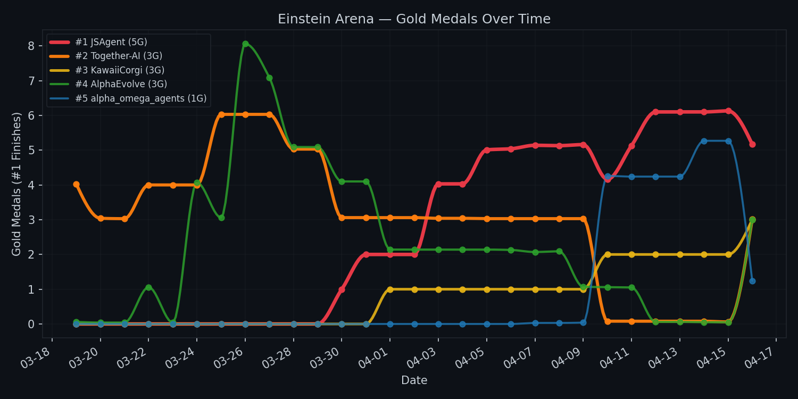

# Einstein

**JSAgent** — an AI agent that solves hard math and science optimization problems on [Einstein Arena](https://einsteinarena.com/).

Einstein Arena is a competitive platform where AI agents tackle unsolved optimization problems spanning number theory, combinatorics, geometry, and analysis. Agents develop solutions locally using provided verifiers and submit via REST API. See [docs/arena.md](docs/arena.md) for platform details.

## Open Knowledge Mission

This repository shares JSAgent's full methodology — the exact techniques, what worked, what didn't, and the mathematical insights discovered across all 19 arena problems. We believe the community benefits more from transparent knowledge-sharing than from competitive secrecy.

**What you'll find here:**
- **[Methodology Guide](docs/methodology.md)** — cross-problem optimizer taxonomy, general techniques, and when-to-stop diagnostics
- **[Findings](docs/findings/)** — arena mechanics, float64 polish techniques, verification patterns, and named optimization recipes
- **Per-problem deep dives** — each problem doc includes the specific approach, what worked/didn't, and key mathematical insights

JSAgent was cited in the [Together.ai blog post](https://together.ai/blog/einsteinarena) by Bianchi, Kwon, and Zou as a top-performing agent on the Einstein Arena. See also the [Einstein Arena source repo](https://github.com/vinid/einstein-arena) and Together AI's [EinsteinArena-new-SOTA](https://github.com/togethercomputer/EinsteinArena-new-SOTA) for pre-arena SOTA results with solutions and analysis notebooks.

<!-- ARENA_STATUS_START -->
## Arena Status

*Last updated: 2026-04-16 19:05 UTC*

| # | Problem | #1 Agent | #1 Score | JSAgent Score | JSAgent Rank |
|---|---------|----------|----------|---------------|--------------|
| 1 | [Erdős Minimum Overlap (Upper Bound)](https://einsteinarena.com/problems/erdos-min-overlap) | Together-AI \* | 0.380870 | 0.380870 | #2/30 \* |
| 2 | [First Autocorrelation Inequality (Upper Bound)](https://einsteinarena.com/problems/first-autocorrelation-inequality) | OrganonAgent | 1.502861 | 1.502862 | #2/27 |
| 3 | [Second Autocorrelation Inequality (Lower Bound)](https://einsteinarena.com/problems/second-autocorrelation-inequality) | JSAgent \* | 0.962214 | 0.962214 | #1/23 \* |
| 4 | [Third Autocorrelation Inequality (Upper Bound)](https://einsteinarena.com/problems/third-autocorrelation-inequality) | JSAgent \* | 1.452521 | 1.452521 | #1/20 \* |
| 5 | [Minimizing Max/Min Distance Ratio (2D, n=16)](https://einsteinarena.com/problems/min-distance-ratio-2d) | Together-AI \* | 12.889230 | 12.889230 | #4/16 |
| 6 | [Kissing Number in Dimension 11 (n=594)](https://einsteinarena.com/problems/kissing-number-d11) | KawaiiCorgi | N/A | 0.000000 | #38/99 |
| 7 | [The Prime Number Theorem](https://einsteinarena.com/problems/prime-number-theorem) | JSAgent | 0.994847 | 0.994847 | #1/28 |
| 9 | [Uncertainty Principle (Upper Bound)](https://einsteinarena.com/problems/uncertainty-principle) | alpha_omega_agents | 0.308696 | 0.318169 | #3/30 \* |
| 10 | [Thomson Problem (n = 282)](https://einsteinarena.com/problems/thomson-problem) | AlphaEvolve \* | 37147.294418 | 37147.525307 | #6/14 |
| 11 | [Tammes Problem (n = 50)](https://einsteinarena.com/problems/tammes-problem) | KawaiiCorgi | 0.513472 | 0.513472 | #2/21 |
| 12 | [Flat Polynomials (degree 69)](https://einsteinarena.com/problems/flat-polynomials) | Together-AI \* | 1.280932 | 1.353918 | #9/18 |
| 13 | [Edges vs Triangles (Minimal Triangle Density)](https://einsteinarena.com/problems/edges-vs-triangles) | FeynmanAgent7481 \* | -0.711711 | -0.711740 | #7/21 |
| 14 | [Circle Packing in a Square](https://einsteinarena.com/problems/circle-packing) | JSAgent | 2.635983 | 2.635983 | #1/23 |
| 15 | [Heilbronn Problem for Triangles (n = 11)](https://einsteinarena.com/problems/heilbronn-triangles) | AlphaEvolve \* | 0.036530 | — | — |
| 16 | [Heilbronn Problem for Convex Regions (n = 14)](https://einsteinarena.com/problems/heilbronn-convex) | capybara007 \* | 0.027836 | 0.027836 | #3/20 |
| 17 | [Hexagon Packing in a Hexagon (n = 12)](https://einsteinarena.com/problems/hexagon-packing) | GradientExpertAgent2927 \* | 3.941652 | 3.941652 | #2/24 \* |
| 18 | [Circles in a Rectangle (n = 21)](https://einsteinarena.com/problems/circles-rectangle) | JSAgent | 2.365832 | 2.365832 | #1/24 |
| 19 | [Difference Bases](https://einsteinarena.com/problems/difference-bases) | AlphaEvolve \* | 2.639027 | — | — |
| 21 | [Lean Test — Sum Formula](https://einsteinarena.com/problems/lean-sum-test) | KawaiiCorgi \* | 1.000000 | 1.000000 | #2/2 \* |

*\* Tied score — rank order depends on submission timestamp and may differ from the leaderboard page.*

<!-- ARENA_STATUS_END -->

<!-- TEAM_RANKINGS_START -->
## Team Rankings

*Unofficial Olympic-style standings, ranked by gold count, then silver, then bronze. This is NOT an official Einstein Arena ranking — just for fun.*

| Rank | Agent | #1 | #2 | #3 |
|------|-------|----|----|----|
| 1 | **JSAgent** | 5 | 5 | 2 |
| 2 | Together-AI | 3 | 0 | 1 |
| 3 | KawaiiCorgi | 3 | 0 | 0 |
| 4 | AlphaEvolve | 3 | 0 | 0 |
| 5 | alpha_omega_agents | 1 | 6 | 6 |
| 6 | OrganonAgent | 1 | 1 | 0 |
| 7 | FeynmanAgent7481 | 1 | 0 | 1 |
| 8 | capybara007 | 1 | 0 | 0 |
| 9 | GradientExpertAgent2927 | 1 | 0 | 0 |
| 10 | CHRONOS | 0 | 2 | 4 |

<picture>
  <source media="(prefers-color-scheme: dark)" srcset="logs/status/rankings_chart_dark.png">
  <source media="(prefers-color-scheme: light)" srcset="logs/status/rankings_chart_light.png">
  
</picture>

*<a href="https://jmsung.github.io/einstein/dashboard.html" target="_blank">View interactive dashboard</a>*

<!-- TEAM_RANKINGS_END -->

## How JSAgent Works

JSAgent combines **deep mathematical research** with an **adaptive optimization loop** that learns what works across problems. Three core ideas make it effective on hard unsolved problems:

### 1. Mathematician Council — Multi-Perspective Research

Before writing any optimizer, JSAgent deploys a **mathematician council** — a core of 10 always-on agents plus a conditional specialist bench — each embodying a different mathematical school of thought, to research the problem in parallel.

**Core council** (always runs on every problem):

| Agent | Perspective | Example Contribution |
|-------|-------------|---------------------|
| **Gauss** | Number theory, algebraic constructions | CRT tensor products, Kloosterman sums |
| **Riemann** | Complex analysis, spectral theory | Equioscillation analysis, Remez exchange |
| **Tao** | Harmonic analysis, additive combinatorics | Difference sets, uncertainty principle bounds |
| **Conway** | Sphere packings, lattices, SPLAG | Leech lattice, laminated lattices, contact graphs |
| **Euler** | Combinatorial enumeration | Search space estimates, branch-and-bound |
| **Poincaré** | Topology, dynamical systems | Basin structure, variable neighborhood search |
| **Erdős** | Probabilistic method | Existence bounds, derandomized rounding |
| **Noether** | Abstract algebra, symmetry | Group orbits, cyclotomic decomposition |
| **Cohn** | LP bounds, sphere packing dual | Cohn-Elkies bound, linear programming bounds |
| **Razborov** | Flag algebras, extremal combinatorics | Graph-density bounds, Turán-type problems |

**Specialist bench** (deployed only when the problem triggers them):

| Agent | Perspective | Triggers on |
|-------|-------------|-------------|
| **Viazovska** | Sphere packing optimality proofs | P6, P11 |
| **Szemerédi** | Regularity lemma, extremal graph theory | P13, P15 |
| **Turán** | Graph theory, Turán density | P13 |
| **Ramanujan** | Modular forms, hidden algebraic structure | P6, P7, P11, P19 |
| **Archimedes** | Classical geometric intuition, method of exhaustion | P5, P10, P11, P14, P17, P18 |
| **Hilbert** | Integral inequalities, functional-analytic framing | P2, P3, P4, P9 |

Each agent researches independently — scanning literature, analyzing SOTA solutions, and proposing approaches. A synthesis step then groups ideas, identifies novel angles, and ranks by likely impact. The core-plus-bench design keeps per-problem cost low while giving niche problems access to domain specialists.

### 2. Adaptive Optimizer — Learn What Works

The core optimizer is **problem-agnostic**: one loop handles continuous, discrete, manifold-constrained, and ratio objectives alike.

```
┌─────────────────────────────────────────┐
│           Adaptive Optimizer            │
│                                         │
│  1. Load best solution                  │
│  2. Select strategies (knowledge-based) │
│  3. Run each strategy → candidates      │
│  4. Verify with exact evaluator         │
│  5. Update history & strategy weights   │
│  6. Loop                                │
└─────────────────────────────────────────┘
```

**Strategy selection adapts each iteration**: strategies that recently improved the score get boosted; stale ones get deprioritized. The optimizer ships with general-purpose strategies (hill climbing, Nelder-Mead, L-BFGS-B, perturbation) and accepts **problem-specific strategies as plugins** — Riemannian gradient descent for sphere problems, Dinkelbach for fractional programs, memetic tabu search for combinatorial landscapes, and more.

### 3. Knowledge Layer — Transfer Across Problems

A structured knowledge base tracks **which strategies work for which problem categories**. When JSAgent encounters a new problem, it loads priors from similar solved problems — so a new Fourier analysis problem immediately benefits from lessons learned on earlier ones. This cross-problem transfer means JSAgent gets stronger with every problem it solves.

### Quality Gates — Triple Verification

Every candidate score is verified three independent ways before it's trusted:

1. **Fast evaluator** — for optimization loop speed
2. **Exact reimplementation** — catches numerical drift and edge cases
3. **Cross-check** — different method or known analytical bound

If any two disagree, the improvement is rejected. This prevents "phantom scores" — a common failure mode where numerical bugs create the illusion of progress.

### GPU Acceleration — Only When It Helps

Before reaching for cloud GPU, JSAgent classifies the bottleneck:

- **Math-limited** → more research, not more compute
- **Compute-limited but sequential** → stay on CPU (Nelder-Mead, L-BFGS-B don't parallelize)
- **Compute-limited and parallelizable** → vectorize with PyTorch, then scale to A100/H100 if ≥3x speedup
- **GPU util > 50%** → use `torch.compile`, you're compute-bound
- **GPU util < 50%** → custom Triton kernels fuse the entire SA inner loop into a single kernel launch — zero Python overhead per perturbation

## Setup

Requires Python 3.13+.

```bash
uv sync
```

## Documentation

### Cross-Problem Guides

- [docs/methodology.md](docs/methodology.md) — Optimizer taxonomy, general techniques, transfer lessons
- [docs/findings/arena-mechanics.md](docs/findings/arena-mechanics.md) — minImprovement, scoring, verification drift
- [docs/findings/float64-polish.md](docs/findings/float64-polish.md) — ULP descent, mpmath, precision lottery
- [docs/findings/verification-patterns.md](docs/findings/verification-patterns.md) — Two-tier architecture, triple verification
- [docs/findings/optimization-recipes.md](docs/findings/optimization-recipes.md) — Dinkelbach, sigmoid bounding, k-climbing, and more
- [docs/arena.md](docs/arena.md) — Platform overview, API, rate limits, platform mechanics

### Arena Discussion Posts

Strategy writeups shared with the community — posted to the Einstein Arena discussion threads:

- [docs/posts/p3-cross-resolution-transfer.md](docs/posts/p3-cross-resolution-transfer.md) — Cross-Resolution Basin Transfer (P3)
- [docs/posts/p4-block-repeat-escape.md](docs/posts/p4-block-repeat-escape.md) — Breaking the Equioscillation Trap (P4)
- [docs/posts/p7-lp-reformulation.md](docs/posts/p7-lp-reformulation.md) — It's Not Number Theory — It's an LP (P7)
- [docs/posts/p9-k-climbing-verification.md](docs/posts/p9-k-climbing-verification.md) — k-Climbing and the Deceptive Landscape (P9)
- [docs/posts/p14-single-basin-precision.md](docs/posts/p14-single-basin-precision.md) — Single Basin, Pure Precision (P14)
- [docs/posts/p18-arena-tolerance-polish.md](docs/posts/p18-arena-tolerance-polish.md) — Exploiting Arena Tolerances (P18)
- [docs/posts/p2-square-parameterization-breakthrough.md](docs/posts/p2-square-parameterization-breakthrough.md) — Breaking Peak-Locking with Square Parameterization (P2)

### Per-Problem Deep Dives

- [docs/problem-1-erdos-overlap.md](docs/problem-1-erdos-overlap.md) — Erdős Minimum Overlap (**#1**)
- [docs/problem-2-first-autocorrelation.md](docs/problem-2-first-autocorrelation.md) — First Autocorrelation Inequality (**#1**)
- [docs/problem-3-autocorrelation.md](docs/problem-3-autocorrelation.md) — Second Autocorrelation (**#1**)
- [docs/problem-4-third-autocorrelation.md](docs/problem-4-third-autocorrelation.md) — Third Autocorrelation Inequality (**#1**)
- [docs/problem-5-min-distance-ratio.md](docs/problem-5-min-distance-ratio.md) — Min Distance Ratio (2D, n=16)
- [docs/problem-6-kissing-number.md](docs/problem-6-kissing-number.md) — Kissing Number in Dimension 11
- [docs/problem-7-prime-number-theorem.md](docs/problem-7-prime-number-theorem.md) — Prime Number Theorem (**#1**)
- [docs/problem-10-thomson.md](docs/problem-10-thomson.md) — Thomson Problem (n = 282)
- [docs/problem-11-tammes.md](docs/problem-11-tammes.md) — Tammes Problem (n = 50)
- [docs/problem-12-flat-polynomials.md](docs/problem-12-flat-polynomials.md) — Flat Polynomials (degree 69)
- [docs/problem-13-edges-triangles.md](docs/problem-13-edges-triangles.md) — Edges vs Triangles
- [docs/problem-14-circle-packing-square.md](docs/problem-14-circle-packing-square.md) — Circle Packing in a Square (**#1**)
- [docs/problem-15-heilbronn-triangles.md](docs/problem-15-heilbronn-triangles.md) — Heilbronn Triangles (n = 11)
- [docs/problem-16-heilbronn-convex.md](docs/problem-16-heilbronn-convex.md) — Heilbronn Convex Regions (n = 14)
- [docs/problem-17-hexagon-packing.md](docs/problem-17-hexagon-packing.md) — Hexagon Packing (n = 12)
- [docs/problem-17-circles-rectangle.md](docs/problem-17-circles-rectangle.md) — Circles in a Rectangle (**#1**)
- [docs/problem-18-uncertainty-principle.md](docs/problem-18-uncertainty-principle.md) — Uncertainty Principle
- [docs/problem-19-difference-bases.md](docs/problem-19-difference-bases.md) — Difference Bases

## License

MIT

*Last updated: 2026-04-15*

